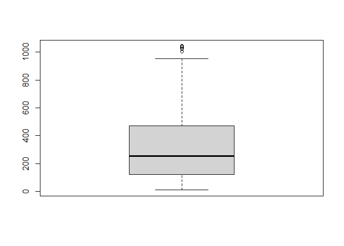
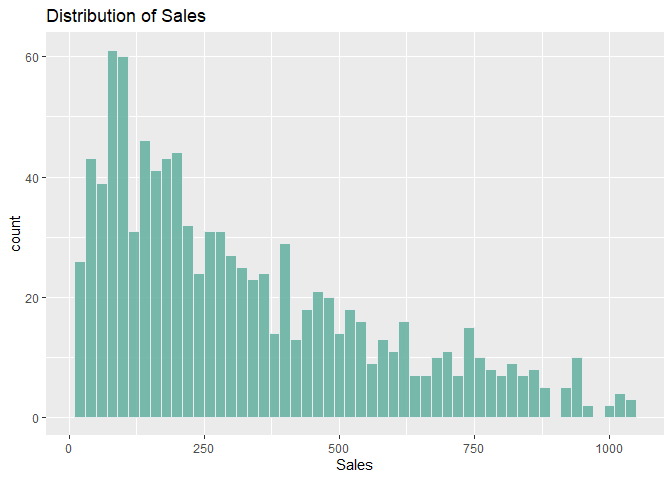
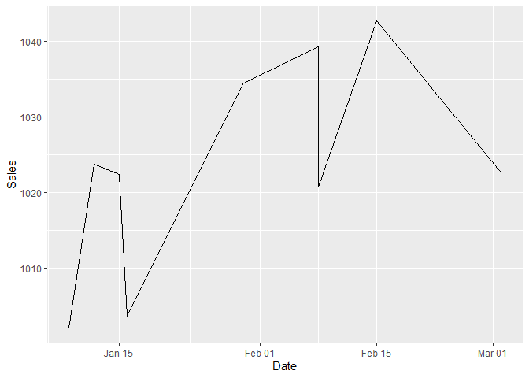
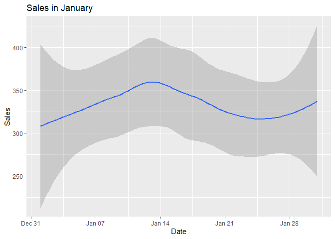
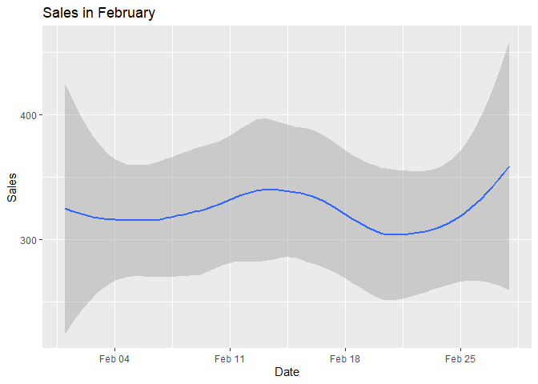
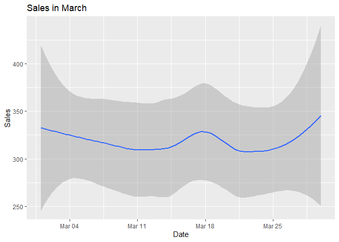
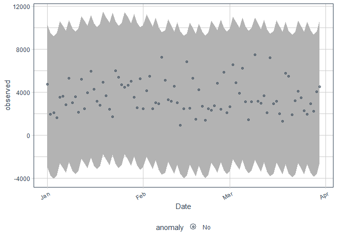

**Objective of the Analysis**

Detecting fraud by checking whether there are any anomalies in the given
dataset

**Loading the required libraries**

``` r
library(readr)
library(tidyr)
library(stringr)
library(dplyr)
library(ggplot2)
library(lubridate)
library(tibbletime)
library(anomalize)  
```

**Reading in the data**

``` r
df <- read_csv("C:/Users/Githu/Downloads/Supermarket_Sales_Forecasting.csv")
```

**Checking the data**

``` r
# Determining the number of records
dim(df)
```

    ## [1] 1000    2

``` r
# Viewing the top of the dataset
knitr::kable(
  head(df)
)
```

| Date      |     Sales|
|:----------|---------:|
| 1/5/2019  |  548.9715|
| 3/8/2019  |   80.2200|
| 3/3/2019  |  340.5255|
| 1/27/2019 |  489.0480|
| 2/8/2019  |  634.3785|
| 3/25/2019 |  627.6165|

``` r
# Viewing the bottom of our dataset
knitr::kable(
  tail(df)
)
```

| Date      |      Sales|
|:----------|----------:|
| 2/18/2019 |    63.9975|
| 1/29/2019 |    42.3675|
| 3/2/2019  |  1022.4900|
| 2/9/2019  |    33.4320|
| 2/22/2019 |    69.1110|
| 2/18/2019 |   649.2990|

``` r
# Checking the data types
sapply(df, class)
```

    ##        Date       Sales 
    ## "character"   "numeric"

``` r
# Converting the date column to its appropriate data type
df$Date <- as_date(mdy(df$Date))
sapply(df, class)
```

    ##      Date     Sales 
    ##    "Date" "numeric"

``` r
# Checking for missing values
colSums(is.na(df))
```

    ##  Date Sales 
    ##     0     0

``` r
# Checking for outliers
boxplot(df$Sales)
```



The data requires little cleaning as it has no missing values and the
outliers present in the sales variable will not be dropped.

**Exploring the dataset**

``` r
# Distribution of sales
df %>%
  ggplot(aes(x=Sales)) +
  geom_histogram(binwidth = 20, fill="#69b3a2", color="#e9ecef", alpha=0.9) +
  ggtitle("Distribution of Sales")
```



Most frequent sales values ranged between 100 and 200. The outliers were
observed in values over 1000

``` r
# Investigating the sales over 1000
df %>%
  select(Date, Sales) %>%
  filter(Sales>1000) %>%
  ggplot(aes(x=Date, y = Sales))+
  geom_line()
```



The highest Sales value was recorded on February 15th.

``` r
# Visualization of sales for January
df %>%
  select(Date, Sales) %>%
  mutate(month=month(Date, label = TRUE)) %>% 
  filter(month=="Jan") %>%
  ggplot(aes(x=Date, y = Sales))+
  ggtitle("Sales in January") +
  geom_smooth()
```



``` r
# Visualization of sales for February
df %>%
  select(Date, Sales) %>%
  mutate(month=month(Date, label = TRUE)) %>% 
  filter(month=="Feb") %>%
  ggplot(aes(x=Date, y = Sales))+
  ggtitle("Sales in February") +
  geom_smooth()
```



``` r
# Visualization of sales for March
df %>%
  select(Date, Sales) %>%
  mutate(month=month(Date, label = TRUE)) %>% 
  filter(month=="Mar") %>%
  ggplot(aes(x=Date, y = Sales))+
  ggtitle("Sales in March") +
  geom_smooth()
```



``` r
# Total sales for January
df %>%
  select(Date, Sales) %>%
  mutate(month=month(Date, label = TRUE)) %>% 
  filter(month=="Jan") %>%
  group_by(month) %>%
  summarise(sum = sum(Sales))
```

    ## # A tibble: 1 x 2
    ##   month     sum
    ##   <ord>   <dbl>
    ## 1 Jan   116292.

``` r
# Total sales for February
df %>%
  select(Date, Sales) %>%
  mutate(month=month(Date, label = TRUE)) %>% 
  filter(month=="Feb") %>%
  group_by(month) %>%
  summarise(sum = sum(Sales))
```

    ## # A tibble: 1 x 2
    ##   month    sum
    ##   <ord>  <dbl>
    ## 1 Feb   97219.

``` r
# Total Sales for March
df %>%
  select(Date, Sales) %>%
  mutate(month=month(Date, label = TRUE)) %>% 
  filter(month=="Mar") %>%
  group_by(month) %>%
  summarise(sum = sum(Sales))
```

    ## # A tibble: 1 x 2
    ##   month     sum
    ##   <ord>   <dbl>
    ## 1 Mar   109456.

The month of January had the highest total sales

**Anomaly Detection**

``` r
# Summarizing by date
df1 <- df %>% 
  group_by(Date) %>%
  summarise_all(list(mean = mean, sum = sum))

# Plotting anomalies
df1 %>%
  as_tbl_time(Date) %>%
  time_decompose(sum) %>%
  anomalize(remainder) %>%
  time_recompose() %>%
  plot_anomalies(time_recomposed = TRUE, ncol = 3, alpha_dots = 0.5)
```

    ## frequency = 7 days

    ## trend = 30 days

    ## Registered S3 method overwritten by 'quantmod':
    ##   method            from
    ##   as.zoo.data.frame zoo



There are no anomalies detected in the dataset therefore no fraudulent
transactions were recorded.
