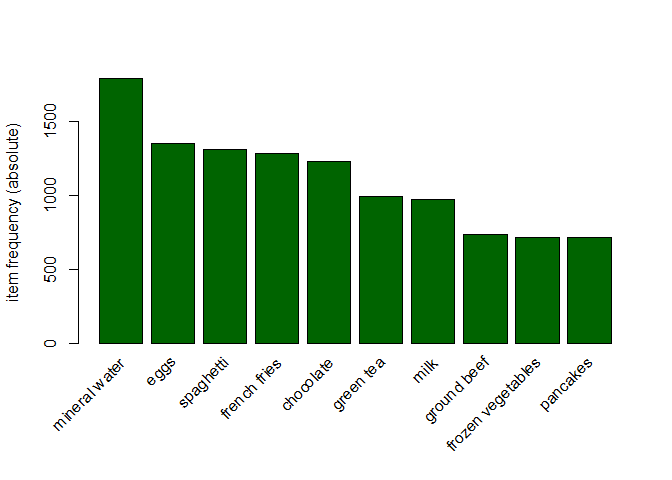
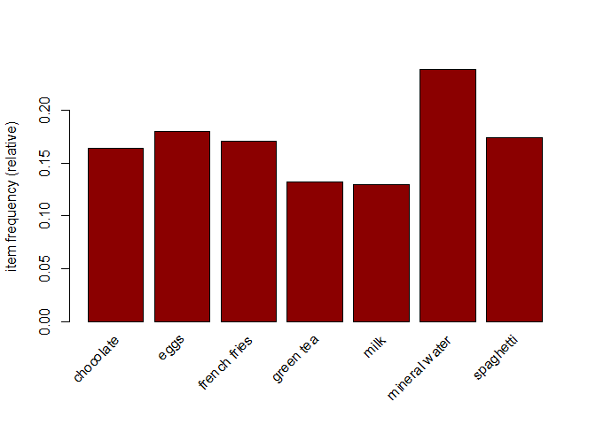

**Objective of the analysis**

Performing associative analysis on supermarket sales data to identify
relationships in the products purchased by customers.

**Loading the required libraries**

``` r
# Loading the required libraries
library(arules)
library(arulesViz)
```

**Reading in the data as transactions**

``` r
sales_transaction <- read.transactions("C:/Users/Githu/Downloads/Supermarket_Sales_DatasetII.csv", sep = ",")
sales_transaction
```

    ## transactions in sparse format with
    ##  7501 transactions (rows) and
    ##  119 items (columns)

**Checking the data**

``` r
# Verifying the class type
class(sales_transaction)
```

    ## [1] "transactions"
    ## attr(,"package")
    ## [1] "arules"

``` r
# Previewing the first five tranactions
inspect(sales_transaction[1:5])
```

    ##     items              
    ## [1] {almonds,          
    ##      antioxydant juice,
    ##      avocado,          
    ##      cottage cheese,   
    ##      energy drink,     
    ##      frozen smoothie,  
    ##      green grapes,     
    ##      green tea,        
    ##      honey,            
    ##      low fat yogurt,   
    ##      mineral water,    
    ##      olive oil,        
    ##      salad,            
    ##      salmon,           
    ##      shrimp,           
    ##      spinach,          
    ##      tomato juice,     
    ##      vegetables mix,   
    ##      whole weat flour, 
    ##      yams}             
    ## [2] {burgers,          
    ##      eggs,             
    ##      meatballs}        
    ## [3] {chutney}          
    ## [4] {avocado,          
    ##      turkey}           
    ## [5] {energy bar,       
    ##      green tea,        
    ##      milk,             
    ##      mineral water,    
    ##      whole wheat rice}

``` r
# Getting the summary of the transaction
summary(sales_transaction)
```

    ## transactions as itemMatrix in sparse format with
    ##  7501 rows (elements/itemsets/transactions) and
    ##  119 columns (items) and a density of 0.03288973 
    ## 
    ## most frequent items:
    ## mineral water          eggs     spaghetti  french fries     chocolate 
    ##          1788          1348          1306          1282          1229 
    ##       (Other) 
    ##         22405 
    ## 
    ## element (itemset/transaction) length distribution:
    ## sizes
    ##    1    2    3    4    5    6    7    8    9   10   11   12   13   14   15   16 
    ## 1754 1358 1044  816  667  493  391  324  259  139  102   67   40   22   17    4 
    ##   18   19   20 
    ##    1    2    1 
    ## 
    ##    Min. 1st Qu.  Median    Mean 3rd Qu.    Max. 
    ##   1.000   2.000   3.000   3.914   5.000  20.000 
    ## 
    ## includes extended item information - examples:
    ##              labels
    ## 1           almonds
    ## 2 antioxydant juice
    ## 3         asparagus

``` r
# Getting the number of items bought
length(itemLabels(sales_transaction))
```

    ## [1] 119

``` r
# Plot the top ten most frequently purchased items
itemFrequencyPlot(sales_transaction, topN = 10, type='absolute',col="darkgreen")
```

<!-- -->

The most frequently bought items include mineral water, eggs, spaghetti
and french fries.

``` r
# Plotting the items with minimum support
itemFrequencyPlot(sales_transaction, support = 0.1,col="darkred")
```

<!-- -->

Most of the items had a support of greater than 0.1

**Building a model using association rules**

``` r
# Using minimum support of 0.001 and confidence of 0.8
rules1 <- apriori(sales_transaction, parameter = list(supp = 0.001, conf = 0.8, maxlen=10))
```

    ## Apriori
    ## 
    ## Parameter specification:
    ##  confidence minval smax arem  aval originalSupport maxtime support minlen
    ##         0.8    0.1    1 none FALSE            TRUE       5   0.001      1
    ##  maxlen target  ext
    ##      10  rules TRUE
    ## 
    ## Algorithmic control:
    ##  filter tree heap memopt load sort verbose
    ##     0.1 TRUE TRUE  FALSE TRUE    2    TRUE
    ## 
    ## Absolute minimum support count: 7 
    ## 
    ## set item appearances ...[0 item(s)] done [0.00s].
    ## set transactions ...[119 item(s), 7501 transaction(s)] done [0.01s].
    ## sorting and recoding items ... [116 item(s)] done [0.00s].
    ## creating transaction tree ... done [0.01s].
    ## checking subsets of size 1 2 3 4 5 6 done [0.03s].
    ## writing ... [74 rule(s)] done [0.00s].
    ## creating S4 object  ... done [0.01s].

``` r
summary(rules1)
```

    ## set of 74 rules
    ## 
    ## rule length distribution (lhs + rhs):sizes
    ##  3  4  5  6 
    ## 15 42 16  1 
    ## 
    ##    Min. 1st Qu.  Median    Mean 3rd Qu.    Max. 
    ##   3.000   4.000   4.000   4.041   4.000   6.000 
    ## 
    ## summary of quality measures:
    ##     support           confidence        coverage             lift       
    ##  Min.   :0.001067   Min.   :0.8000   Min.   :0.001067   Min.   : 3.356  
    ##  1st Qu.:0.001067   1st Qu.:0.8000   1st Qu.:0.001333   1st Qu.: 3.432  
    ##  Median :0.001133   Median :0.8333   Median :0.001333   Median : 3.795  
    ##  Mean   :0.001256   Mean   :0.8504   Mean   :0.001479   Mean   : 4.823  
    ##  3rd Qu.:0.001333   3rd Qu.:0.8889   3rd Qu.:0.001600   3rd Qu.: 4.877  
    ##  Max.   :0.002533   Max.   :1.0000   Max.   :0.002666   Max.   :12.722  
    ##      count       
    ##  Min.   : 8.000  
    ##  1st Qu.: 8.000  
    ##  Median : 8.500  
    ##  Mean   : 9.419  
    ##  3rd Qu.:10.000  
    ##  Max.   :19.000  
    ## 
    ## mining info:
    ##               data ntransactions support confidence
    ##  sales_transaction          7501   0.001        0.8

``` r
# Using minimum support of 0.002 and confidence of 0.6
rules2 <- apriori(sales_transaction, parameter = list(supp = 0.002, conf = 0.6, maxlen=10))
```

    ## Apriori
    ## 
    ## Parameter specification:
    ##  confidence minval smax arem  aval originalSupport maxtime support minlen
    ##         0.6    0.1    1 none FALSE            TRUE       5   0.002      1
    ##  maxlen target  ext
    ##      10  rules TRUE
    ## 
    ## Algorithmic control:
    ##  filter tree heap memopt load sort verbose
    ##     0.1 TRUE TRUE  FALSE TRUE    2    TRUE
    ## 
    ## Absolute minimum support count: 15 
    ## 
    ## set item appearances ...[0 item(s)] done [0.00s].
    ## set transactions ...[119 item(s), 7501 transaction(s)] done [0.01s].
    ## sorting and recoding items ... [115 item(s)] done [0.00s].
    ## creating transaction tree ... done [0.01s].
    ## checking subsets of size 1 2 3 4 5 done [0.01s].
    ## writing ... [43 rule(s)] done [0.00s].
    ## creating S4 object  ... done [0.00s].

``` r
summary(rules2)
```

    ## set of 43 rules
    ## 
    ## rule length distribution (lhs + rhs):sizes
    ##  3  4 
    ## 16 27 
    ## 
    ##    Min. 1st Qu.  Median    Mean 3rd Qu.    Max. 
    ##   3.000   3.000   4.000   3.628   4.000   4.000 
    ## 
    ## summary of quality measures:
    ##     support           confidence        coverage             lift       
    ##  Min.   :0.002133   Min.   :0.6000   Min.   :0.002533   Min.   : 2.517  
    ##  1st Qu.:0.002200   1st Qu.:0.6180   1st Qu.:0.003333   1st Qu.: 2.637  
    ##  Median :0.002400   Median :0.6400   Median :0.003866   Median : 2.743  
    ##  Mean   :0.002713   Mean   :0.6643   Mean   :0.004145   Mean   : 3.315  
    ##  3rd Qu.:0.003066   3rd Qu.:0.6972   3rd Qu.:0.004666   3rd Qu.: 3.344  
    ##  Max.   :0.005066   Max.   :0.9500   Max.   :0.007999   Max.   :11.976  
    ##      count      
    ##  Min.   :16.00  
    ##  1st Qu.:16.50  
    ##  Median :18.00  
    ##  Mean   :20.35  
    ##  3rd Qu.:23.00  
    ##  Max.   :38.00  
    ## 
    ## mining info:
    ##               data ntransactions support confidence
    ##  sales_transaction          7501   0.002        0.6

A minimum support and confidence of 0.001 and 0.8 generates 74 rules
while a minimum support and confidence of 0.002 and 0.6 generates 43
rules

``` r
# Sorting the rules based on confidence
inspect(sort(rules1, by="confidence", decreasing = T)[1:10])
```

    ##      lhs                       rhs                 support confidence    coverage      lift count
    ## [1]  {french fries,                                                                              
    ##       mushroom cream sauce,                                                                      
    ##       pasta}                => {escalope}      0.001066524  1.0000000 0.001066524 12.606723     8
    ## [2]  {ground beef,                                                                               
    ##       light cream,                                                                               
    ##       olive oil}            => {mineral water} 0.001199840  1.0000000 0.001199840  4.195190     9
    ## [3]  {cake,                                                                                      
    ##       meatballs,                                                                                 
    ##       mineral water}        => {milk}          0.001066524  1.0000000 0.001066524  7.717078     8
    ## [4]  {cake,                                                                                      
    ##       olive oil,                                                                                 
    ##       shrimp}               => {mineral water} 0.001199840  1.0000000 0.001199840  4.195190     9
    ## [5]  {mushroom cream sauce,                                                                      
    ##       pasta}                => {escalope}      0.002532996  0.9500000 0.002666311 11.976387    19
    ## [6]  {red wine,                                                                                  
    ##       soup}                 => {mineral water} 0.001866418  0.9333333 0.001999733  3.915511    14
    ## [7]  {eggs,                                                                                      
    ##       mineral water,                                                                             
    ##       pasta}                => {shrimp}        0.001333156  0.9090909 0.001466471 12.722185    10
    ## [8]  {herb & pepper,                                                                             
    ##       mineral water,                                                                             
    ##       rice}                 => {ground beef}   0.001333156  0.9090909 0.001466471  9.252498    10
    ## [9]  {ground beef,                                                                               
    ##       pancakes,                                                                                  
    ##       whole wheat rice}     => {mineral water} 0.001333156  0.9090909 0.001466471  3.813809    10
    ## [10] {frozen vegetables,                                                                         
    ##       milk,                                                                                      
    ##       spaghetti,                                                                                 
    ##       turkey}               => {mineral water} 0.001199840  0.9000000 0.001333156  3.775671     9

``` r
inspect(sort(rules2, by="confidence", decreasing = T)[1:10])
```

    ##      lhs                                       rhs             support    
    ## [1]  {mushroom cream sauce,pasta}           => {escalope}      0.002532996
    ## [2]  {frozen vegetables,olive oil,tomatoes} => {spaghetti}     0.002133049
    ## [3]  {pancakes,soup,spaghetti}              => {mineral water} 0.002266364
    ## [4]  {frozen vegetables,milk,soup}          => {mineral water} 0.003066258
    ## [5]  {frozen vegetables,ground beef,shrimp} => {spaghetti}     0.002399680
    ## [6]  {red wine,turkey}                      => {mineral water} 0.002133049
    ## [7]  {cooking oil,pancakes,spaghetti}       => {mineral water} 0.002133049
    ## [8]  {nonfat milk,spaghetti}                => {mineral water} 0.002399680
    ## [9]  {eggs,milk,olive oil}                  => {mineral water} 0.002666311
    ## [10] {cooking oil,eggs,spaghetti}           => {mineral water} 0.002932942
    ##      confidence coverage    lift      count
    ## [1]  0.9500000  0.002666311 11.976387 19   
    ## [2]  0.8421053  0.002532996  4.836624 16   
    ## [3]  0.7727273  0.002932942  3.241738 17   
    ## [4]  0.7666667  0.003999467  3.216312 23   
    ## [5]  0.7500000  0.003199573  4.307619 18   
    ## [6]  0.7272727  0.002932942  3.051047 16   
    ## [7]  0.7272727  0.002932942  3.051047 16   
    ## [8]  0.7200000  0.003332889  3.020537 18   
    ## [9]  0.7142857  0.003732836  2.996564 20   
    ## [10] 0.7096774  0.004132782  2.977232 22

``` r
# Visualizing the top 10 rules
top <- head(rules1, n = 10, by='confidence')
plot(top, method = "graph",  engine = "interactive")

top1 <- head(rules2, n = 10, by='confidence')
plot(top1, method = "graph",  engine = "interactive")
```

Filtering by the drop down items list gives the associated products that
are bought frequently with that product. For example french fries is
associated with mushroom cream sauce and escalope. Pasta is most often
bought with escalope and mushroom cream sauce as well.

**Finding rules related to certain items**

``` r
eggs <- apriori(sales_transaction, parameter = list(supp=0.001, conf=0.8), appearance = list(default="lhs", rhs="eggs"))
```

    ## Apriori
    ## 
    ## Parameter specification:
    ##  confidence minval smax arem  aval originalSupport maxtime support minlen
    ##         0.8    0.1    1 none FALSE            TRUE       5   0.001      1
    ##  maxlen target  ext
    ##      10  rules TRUE
    ## 
    ## Algorithmic control:
    ##  filter tree heap memopt load sort verbose
    ##     0.1 TRUE TRUE  FALSE TRUE    2    TRUE
    ## 
    ## Absolute minimum support count: 7 
    ## 
    ## set item appearances ...[1 item(s)] done [0.00s].
    ## set transactions ...[119 item(s), 7501 transaction(s)] done [0.01s].
    ## sorting and recoding items ... [116 item(s)] done [0.00s].
    ## creating transaction tree ... done [0.01s].
    ## checking subsets of size 1 2 3 4 5 6 done [0.02s].
    ## writing ... [2 rule(s)] done [0.00s].
    ## creating S4 object  ... done [0.00s].

``` r
inspect(eggs)
```

    ##     lhs                             rhs    support     confidence coverage   
    ## [1] {mineral water,pasta,shrimp} => {eggs} 0.001333156 0.8333333  0.001599787
    ## [2] {black tea,spaghetti,turkey} => {eggs} 0.001066524 0.8888889  0.001199840
    ##     lift     count
    ## [1] 4.637117 10   
    ## [2] 4.946258  8

Customers buy pasta and shrimp before buying eggs. These items can be
put next to each other for easier access and to improve sales.

``` r
# Chocolate association rules
chocolate <- apriori(sales_transaction, parameter = list(supp=0.001, conf=0.8), appearance = list(default="lhs", rhs="chocolate"))
```

    ## Apriori
    ## 
    ## Parameter specification:
    ##  confidence minval smax arem  aval originalSupport maxtime support minlen
    ##         0.8    0.1    1 none FALSE            TRUE       5   0.001      1
    ##  maxlen target  ext
    ##      10  rules TRUE
    ## 
    ## Algorithmic control:
    ##  filter tree heap memopt load sort verbose
    ##     0.1 TRUE TRUE  FALSE TRUE    2    TRUE
    ## 
    ## Absolute minimum support count: 7 
    ## 
    ## set item appearances ...[1 item(s)] done [0.00s].
    ## set transactions ...[119 item(s), 7501 transaction(s)] done [0.01s].
    ## sorting and recoding items ... [116 item(s)] done [0.00s].
    ## creating transaction tree ... done [0.01s].
    ## checking subsets of size 1 2 3 4 5 6 done [0.02s].
    ## writing ... [2 rule(s)] done [0.00s].
    ## creating S4 object  ... done [0.00s].

``` r
inspect(chocolate)
```

    ##     lhs                               rhs         support     confidence
    ## [1] {red wine,tomato sauce}        => {chocolate} 0.001066524 0.8000000 
    ## [2] {escalope,french fries,shrimp} => {chocolate} 0.001066524 0.8888889 
    ##     coverage    lift     count
    ## [1] 0.001333156 4.882669 8    
    ## [2] 0.001199840 5.425188 8

Customers are likely to purchase chocolates when they have red wine and
tomato sauce in their shopping basket. The analysis has identified the
most frequently bought items and associated products of the most common
bought items. This will definitely help in managing the layout when
stocking the associated products and in generating deals among
associated items in order to optimize sales.
