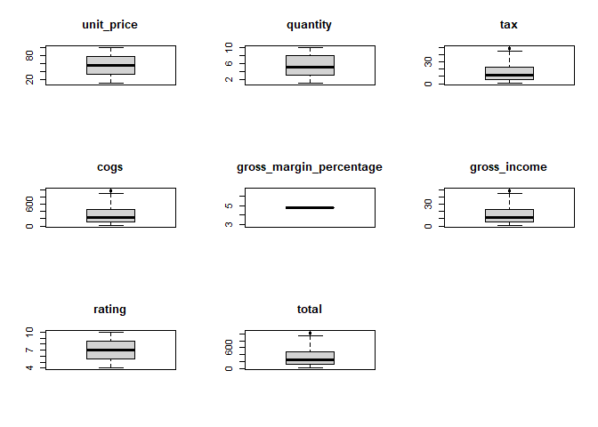
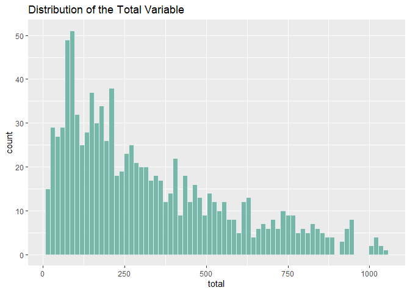
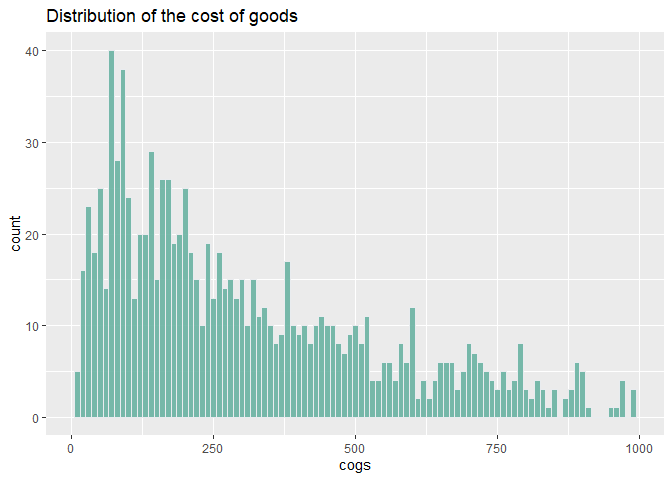
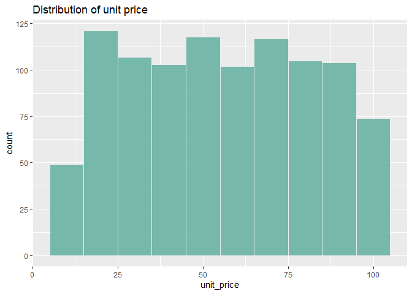
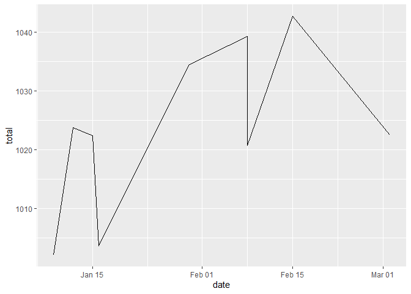
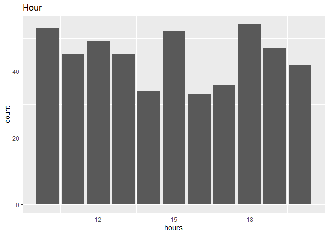
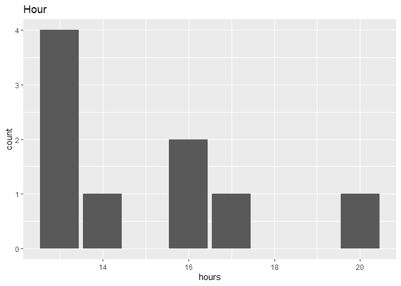
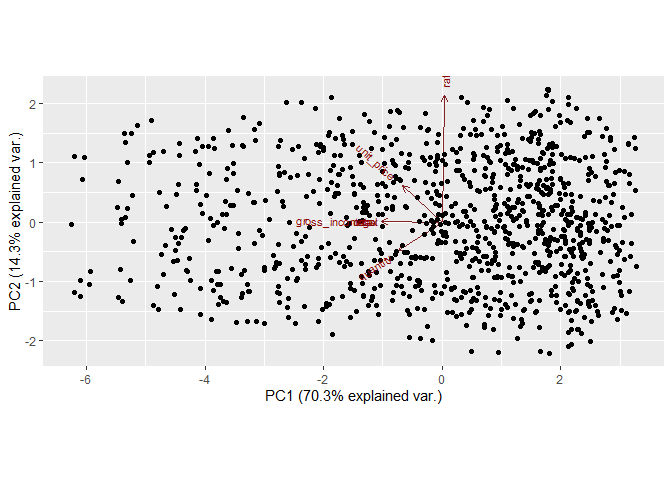
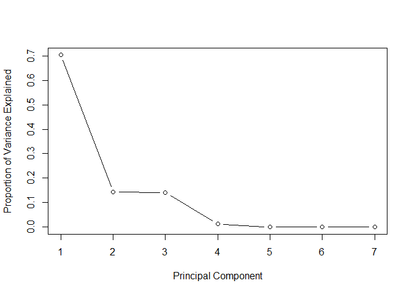
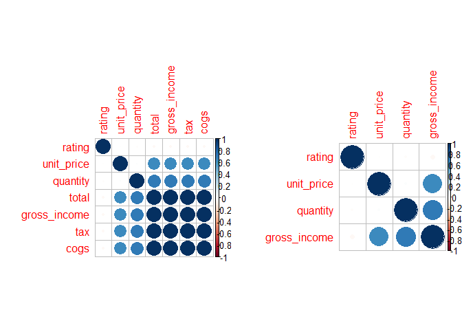

**Overview of the Project**

Finding insights from a sales dataset that will inform the marketing
department on the most relevant strategies that will result in the
highest number of sales.

**Objective of the Study**

Explore dimensionality reduction techniques (specifically Principal
Component Analysis) and feature selection (Filter method) in the given
dataset. Dimensionality reduction techniques reduces the number of
features in a dataset by creating new combinations of features while
feature selection reduces the number of features in a dataset by
excluding or including them without any change.

**Loading the libraries**

``` r
library(readr)
library(stringr)
library(tidyr)
library(lubridate)
library(dplyr)
library(ggplot2)
library(ggbiplot)
library(corrplot)
library(caret)
library(FSelector)
```

**Reading the data**

``` r
sales <- read_csv("C:/Users/Githu/Downloads/Supermarket_Dataset_1.csv")
```

**Checking the data**

``` r
# Determining the number of records
dim(sales)
```

    ## [1] 1000   16

``` r
# Viewing the top of our dataset
head(sales)
```

    ## # A tibble: 6 x 16
    ##   `Invoice ID` Branch `Customer type` Gender `Product line` `Unit price`
    ##   <chr>        <chr>  <chr>           <chr>  <chr>                 <dbl>
    ## 1 750-67-8428  A      Member          Female Health and be~         74.7
    ## 2 226-31-3081  C      Normal          Female Electronic ac~         15.3
    ## 3 631-41-3108  A      Normal          Male   Home and life~         46.3
    ## 4 123-19-1176  A      Member          Male   Health and be~         58.2
    ## 5 373-73-7910  A      Normal          Male   Sports and tr~         86.3
    ## 6 699-14-3026  C      Normal          Male   Electronic ac~         85.4
    ## # ... with 10 more variables: Quantity <dbl>, Tax <dbl>, Date <chr>,
    ## #   Time <time>, Payment <chr>, cogs <dbl>, `gross margin percentage` <dbl>,
    ## #   `gross income` <dbl>, Rating <dbl>, Total <dbl>

``` r
# Viewing the bottom of our dataset
tail(sales)
```

    ## # A tibble: 6 x 16
    ##   `Invoice ID` Branch `Customer type` Gender `Product line` `Unit price`
    ##   <chr>        <chr>  <chr>           <chr>  <chr>                 <dbl>
    ## 1 652-49-6720  C      Member          Female Electronic ac~         61.0
    ## 2 233-67-5758  C      Normal          Male   Health and be~         40.4
    ## 3 303-96-2227  B      Normal          Female Home and life~         97.4
    ## 4 727-02-1313  A      Member          Male   Food and beve~         31.8
    ## 5 347-56-2442  A      Normal          Male   Home and life~         65.8
    ## 6 849-09-3807  A      Member          Female Fashion acces~         88.3
    ## # ... with 10 more variables: Quantity <dbl>, Tax <dbl>, Date <chr>,
    ## #   Time <time>, Payment <chr>, cogs <dbl>, `gross margin percentage` <dbl>,
    ## #   `gross income` <dbl>, Rating <dbl>, Total <dbl>

``` r
# Checking for data types
sapply(sales, class)
```

    ## $`Invoice ID`
    ## [1] "character"
    ## 
    ## $Branch
    ## [1] "character"
    ## 
    ## $`Customer type`
    ## [1] "character"
    ## 
    ## $Gender
    ## [1] "character"
    ## 
    ## $`Product line`
    ## [1] "character"
    ## 
    ## $`Unit price`
    ## [1] "numeric"
    ## 
    ## $Quantity
    ## [1] "numeric"
    ## 
    ## $Tax
    ## [1] "numeric"
    ## 
    ## $Date
    ## [1] "character"
    ## 
    ## $Time
    ## [1] "hms"      "difftime"
    ## 
    ## $Payment
    ## [1] "character"
    ## 
    ## $cogs
    ## [1] "numeric"
    ## 
    ## $`gross margin percentage`
    ## [1] "numeric"
    ## 
    ## $`gross income`
    ## [1] "numeric"
    ## 
    ## $Rating
    ## [1] "numeric"
    ## 
    ## $Total
    ## [1] "numeric"

``` r
# Standardizing column names
colnames(sales) <- tolower(colnames(sales))
names(sales) <- str_replace_all(names(sales), c(" " = "_"))
colnames(sales)
```

    ##  [1] "invoice_id"              "branch"                 
    ##  [3] "customer_type"           "gender"                 
    ##  [5] "product_line"            "unit_price"             
    ##  [7] "quantity"                "tax"                    
    ##  [9] "date"                    "time"                   
    ## [11] "payment"                 "cogs"                   
    ## [13] "gross_margin_percentage" "gross_income"           
    ## [15] "rating"                  "total"

``` r
# Converting the date column to its appropriate data type 
sales$date <- as_date(mdy(sales$date))
sapply(sales, class)
```

    ## $invoice_id
    ## [1] "character"
    ## 
    ## $branch
    ## [1] "character"
    ## 
    ## $customer_type
    ## [1] "character"
    ## 
    ## $gender
    ## [1] "character"
    ## 
    ## $product_line
    ## [1] "character"
    ## 
    ## $unit_price
    ## [1] "numeric"
    ## 
    ## $quantity
    ## [1] "numeric"
    ## 
    ## $tax
    ## [1] "numeric"
    ## 
    ## $date
    ## [1] "Date"
    ## 
    ## $time
    ## [1] "hms"      "difftime"
    ## 
    ## $payment
    ## [1] "character"
    ## 
    ## $cogs
    ## [1] "numeric"
    ## 
    ## $gross_margin_percentage
    ## [1] "numeric"
    ## 
    ## $gross_income
    ## [1] "numeric"
    ## 
    ## $rating
    ## [1] "numeric"
    ## 
    ## $total
    ## [1] "numeric"

``` r
# Checking the missing values
colSums(is.na(sales))
```

    ##              invoice_id                  branch           customer_type 
    ##                       0                       0                       0 
    ##                  gender            product_line              unit_price 
    ##                       0                       0                       0 
    ##                quantity                     tax                    date 
    ##                       0                       0                       0 
    ##                    time                 payment                    cogs 
    ##                       0                       0                       0 
    ## gross_margin_percentage            gross_income                  rating 
    ##                       0                       0                       0 
    ##                   total 
    ##                       0

``` r
# Checking for duplicates
duplicates <- sales[duplicated(sales),]
count(duplicates)
```

    ##  [1] invoice_id              branch                  customer_type          
    ##  [4] gender                  product_line            unit_price             
    ##  [7] quantity                tax                     date                   
    ## [10] time                    payment                 cogs                   
    ## [13] gross_margin_percentage gross_income            rating                 
    ## [16] total                   freq                   
    ## <0 rows> (or 0-length row.names)

``` r
# Checking for outliers
numeric_columns <- sales[c(6:8, 12:16)]

par (mfrow= c ( 3, 3 ))
for (i in 1 : length (numeric_columns)) {
boxplot (numeric_columns[,i], main= names (numeric_columns[i]), type= "l" )
}
```



The dataset requires little cleaning. There are no missing values or
duplicates. The columns names have been standardized to have the same
format. Outliers are present in some of the variables. We will work with
these outliers since this is a sales dataset.

``` r
# Getting the summary of the data
summary(sales)
```

    ##   invoice_id           branch          customer_type         gender         
    ##  Length:1000        Length:1000        Length:1000        Length:1000       
    ##  Class :character   Class :character   Class :character   Class :character  
    ##  Mode  :character   Mode  :character   Mode  :character   Mode  :character  
    ##                                                                             
    ##                                                                             
    ##                                                                             
    ##  product_line         unit_price       quantity          tax         
    ##  Length:1000        Min.   :10.08   Min.   : 1.00   Min.   : 0.5085  
    ##  Class :character   1st Qu.:32.88   1st Qu.: 3.00   1st Qu.: 5.9249  
    ##  Mode  :character   Median :55.23   Median : 5.00   Median :12.0880  
    ##                     Mean   :55.67   Mean   : 5.51   Mean   :15.3794  
    ##                     3rd Qu.:77.94   3rd Qu.: 8.00   3rd Qu.:22.4453  
    ##                     Max.   :99.96   Max.   :10.00   Max.   :49.6500  
    ##       date                time            payment               cogs       
    ##  Min.   :2019-01-01   Length:1000       Length:1000        Min.   : 10.17  
    ##  1st Qu.:2019-01-24   Class1:hms        Class :character   1st Qu.:118.50  
    ##  Median :2019-02-13   Class2:difftime   Mode  :character   Median :241.76  
    ##  Mean   :2019-02-14   Mode  :numeric                       Mean   :307.59  
    ##  3rd Qu.:2019-03-08                                        3rd Qu.:448.90  
    ##  Max.   :2019-03-30                                        Max.   :993.00  
    ##  gross_margin_percentage  gross_income         rating           total        
    ##  Min.   :4.762           Min.   : 0.5085   Min.   : 4.000   Min.   :  10.68  
    ##  1st Qu.:4.762           1st Qu.: 5.9249   1st Qu.: 5.500   1st Qu.: 124.42  
    ##  Median :4.762           Median :12.0880   Median : 7.000   Median : 253.85  
    ##  Mean   :4.762           Mean   :15.3794   Mean   : 6.973   Mean   : 322.97  
    ##  3rd Qu.:4.762           3rd Qu.:22.4453   3rd Qu.: 8.500   3rd Qu.: 471.35  
    ##  Max.   :4.762           Max.   :49.6500   Max.   :10.000   Max.   :1042.65

``` r
# Frequency table of categorical variables
table(sales$branch)
```

    ## 
    ##   A   B   C 
    ## 340 332 328

``` r
table(sales$customer_type)
```

    ## 
    ## Member Normal 
    ##    501    499

``` r
table(sales$gender)
```

    ## 
    ## Female   Male 
    ##    501    499

``` r
table(sales$product_line)
```

    ## 
    ## Electronic accessories    Fashion accessories     Food and beverages 
    ##                    170                    178                    174 
    ##      Health and beauty     Home and lifestyle      Sports and travel 
    ##                    152                    160                    166

``` r
table(sales$payment)
```

    ## 
    ##        Cash Credit card     Ewallet 
    ##         344         311         345

``` r
# Distribution of total variable
sales %>%
  select(total) %>%
  ggplot(aes(x=total)) +
  geom_histogram(binwidth = 15, fill="#69b3a2", color="#e9ecef", alpha=0.9) +
  ggtitle("Distribution of the Total Variable") 
```



``` r
# Distribution of cost of goods
sales %>%
  ggplot(aes(x=cogs)) +
  geom_histogram(binwidth = 10, fill="#69b3a2", color="#e9ecef", alpha=0.9) +
  ggtitle("Distribution of the cost of goods") 
```



``` r
# Distribution of unit price
sales %>%
  ggplot(aes(x=unit_price)) +
  geom_histogram(binwidth = 10, fill="#69b3a2", color="#e9ecef", alpha=0.9) +
  ggtitle("Distribution of unit price") 
```



``` r
# Finding the average total based on gender

sales %>%
  select(date, total) %>%
  filter(total > 1000) %>%
  ggplot(aes(x=date, y = total))+
  geom_line()
```



The highest total value was recorded in January 15th

``` r
# Plotting the hour component on total<250
sales %>%
  filter(total<250) %>%
  mutate(hours = hour(time)) %>%
  group_by(hours) %>%
  ggplot(aes(x=hours)) +
  ggtitle("Hour") +
  geom_bar()
```



Most popular hour for total values less than 250 is the 18th hour

``` r
# Plotting the hour component on total>1000
sales %>%
  filter(total>1000) %>%
  mutate(hours = hour(time)) %>%
  group_by(hours) %>%
  ggplot(aes(x=hours)) +
  ggtitle("Hour") +
  geom_bar()
```



Most popular hour for total values less than 250 is the 18th hour

**Applying Principal Component Analysis**

``` r
# Initializing the PCA
sales_pca <- prcomp(sales[,c(6:8,12, 14:16)], center = TRUE, scale. = TRUE)
summary(sales_pca)
```

    ## Importance of components:
    ##                           PC1    PC2    PC3     PC4       PC5       PC6
    ## Standard deviation     2.2185 1.0002 0.9939 0.30001 2.981e-16 1.493e-16
    ## Proportion of Variance 0.7031 0.1429 0.1411 0.01286 0.000e+00 0.000e+00
    ## Cumulative Proportion  0.7031 0.8460 0.9871 1.00000 1.000e+00 1.000e+00
    ##                              PC7
    ## Standard deviation     9.831e-17
    ## Proportion of Variance 0.000e+00
    ## Cumulative Proportion  1.000e+00

``` r
names(sales_pca)
```

    ## [1] "sdev"     "rotation" "center"   "scale"    "x"

``` r
# Checking the mean of the variables
sales_pca$center
```

    ##   unit_price     quantity          tax         cogs gross_income       rating 
    ##     55.67213      5.51000     15.37937    307.58738     15.37937      6.97270 
    ##        total 
    ##    322.96675

``` r
# Getting the principal component loadings
sales_pca$rotation
```

    ##                      PC1          PC2          PC3         PC4           PC5
    ## unit_price   -0.29176275  0.270866890 -0.693584569  0.60037161  6.582429e-16
    ## quantity     -0.32452880 -0.212748396  0.633152868  0.66972877  7.430508e-16
    ## tax          -0.44977957  0.004196356  0.001836202 -0.21835146 -8.277641e-01
    ## cogs         -0.44977957  0.004196356  0.001836202 -0.21835146  9.549992e-02
    ## gross_income -0.44977957  0.004196356  0.001836202 -0.21835146  2.290536e-01
    ## rating        0.01867926  0.938775165  0.343575909 -0.01754621 -1.194541e-17
    ## total        -0.44977957  0.004196356  0.001836202 -0.21835146  5.032105e-01
    ##                        PC6           PC7
    ## unit_price    5.894232e-17 -7.635490e-17
    ## quantity      1.864419e-16 -1.721827e-16
    ## tax           1.656386e-02  2.540320e-01
    ## cogs         -5.810190e-01 -6.350565e-01
    ## gross_income  7.836445e-01 -2.888526e-01
    ## rating        1.850076e-17 -7.208985e-17
    ## total        -2.191893e-01  6.698770e-01

``` r
ggbiplot(sales_pca, scale = 0)
```



The first principal component has a 70.3% explained variance while the
second component has 14.3% explained variance. The quantity variable has
the highest factor loadings for the first principal component while the
ratings variable has the highest loadings for the second principal
component.

``` r
# Computing the standard deviation of each principal component
std_dev <- sales_pca$sdev

# Computing variance
pr_var <- std_dev^2

# Proportion of variance explained
prop_varex <- pr_var/sum(pr_var)

#scree plot
plot(prop_varex, xlab = "Principal Component",
             ylab = "Proportion of Variance Explained",
             type = "b")
```



A scree plot is used to access components that describe most of the
variability in the dataset. It shows that two principal components
account for most of the variability and upto four variables can be used
without compromising on explained variance. (There are two clear elbows
in the scree plot; at 2 and 4 on the x-axis). The four variables include
quantity, gross income, unit price and rating.

**Feature Selection using Filter Method**

``` r
# Calculating the correlation matrix
numeric_columns <- sales[,c(6:8,12, 14:16)]
corr_matrix <- cor(numeric_columns)

# Finding variables that are highly correlated
highlyCorrelated <- findCorrelation(corr_matrix, cutoff=0.75)
highlyCorrelated
```

    ## [1] 4 7 3

``` r
names(numeric_columns[,highlyCorrelated])
```

    ## [1] "cogs"  "total" "tax"

``` r
# Removing the highly correlated variables
df <- numeric_columns[-highlyCorrelated]

# Graphical comparison
par(mfrow = c(1, 2))
corrplot(corr_matrix, order = "hclust")
corrplot(cor(df), order = "hclust")
```



The remaining variables after removing the correlated features are unit
price, quantity, gross income and rating.This is similar to the results
of the PCA which highlighted the same variables that accounted for most
variability in the data. It is clear that both methods have the same
goal of reducing features but have different ways of implementing it.

**Implementing Feature ranking**

``` r
# Feature ranking using linear correlation
scores <- linear.correlation(total~., numeric_columns)
scores
```

    ##              attr_importance
    ## unit_price         0.6339621
    ## quantity           0.7055102
    ## tax                1.0000000
    ## cogs               1.0000000
    ## gross_income       1.0000000
    ## rating             0.0364417

The tax, cogs and gross income are highly correlated with the total
variable. It is now clear why tax and cogs were dropped in the filter
method.

``` r
# Using information gain 
scores2 <- information.gain(total~., numeric_columns)
subset <- cutoff.k(scores2, 4)
as.data.frame(subset)
```

    ##         subset
    ## 1          tax
    ## 2         cogs
    ## 3 gross_income
    ## 4     quantity

The results from information gain is similar to that from linear
correlation.
